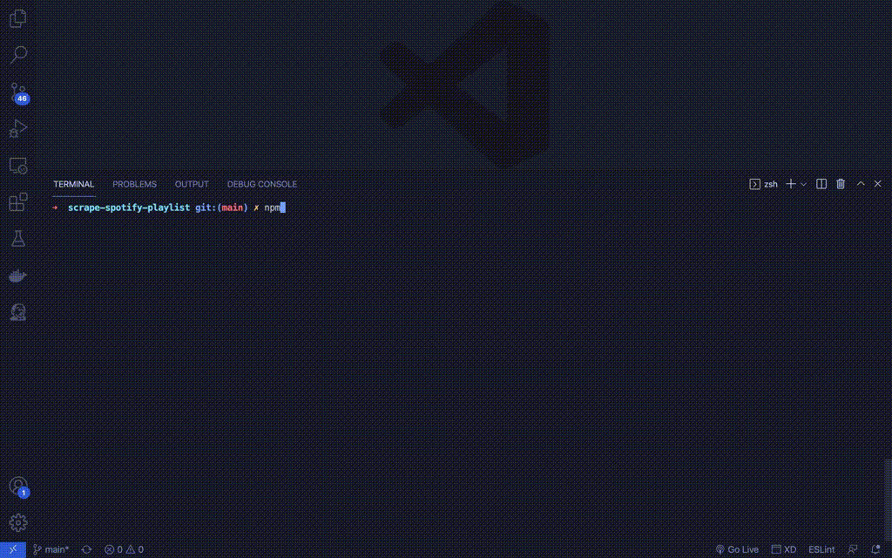

# Scrape Spotify Playlist

Get informations from playlists, including screenshots.

# Steps

## Install

`$ npm install`

## Put informations at `playlists.txt` as follow:

`Name of playlist --- Spotify playlist url`

Example: 

`LoFi Reading 📖📚 --- https://open.spotify.com/playlist/1b3U9LY22mfGmb3CJh5PoT`

## Run

`$ npm start`
